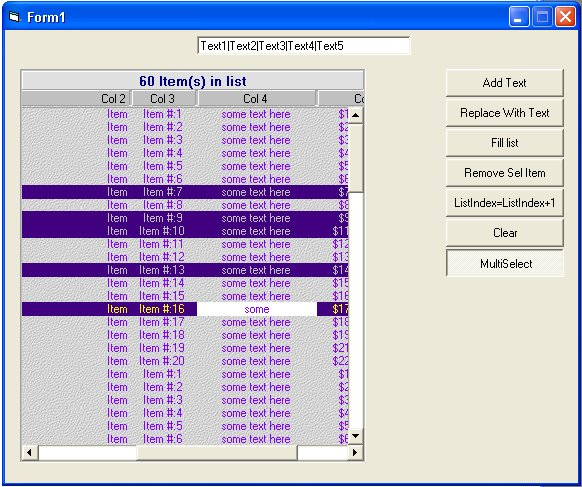



## Multi Column List Box

### Description

This is a multi-columns listbox with many feature like background picture, apparence, AddItem ,RemoveItem, ReplaceItem, IntegralHeight, Caption alignment, Column alignment and many more...
 
### More Info
 

             |
---                |---
**Submitted On**   |2002-03-18 22:30:36
**By**             |[Christian Coutu](https://github.com/Planet-Source-Code/PSCIndex/blob/master/ByAuthor/christian-coutu.md)
**Level**          |Intermediate
**User Rating**    |4.4 (31 globes from 7 users)
**Compatibility**  |VB 6\.0
**Category**       |[Custom Controls/ Forms/  Menus](https://github.com/Planet-Source-Code/PSCIndex/blob/master/ByCategory/custom-controls-forms-menus__1-4.md)
**World**          |[Visual Basic](https://github.com/Planet-Source-Code/PSCIndex/blob/master/ByWorld/visual-basic.md)
**Archive File**   |[Multi\_Colu632573182002\.zip](https://github.com/Planet-Source-Code/christian-coutu-multi-column-list-box__1-32812/archive/master.zip)

